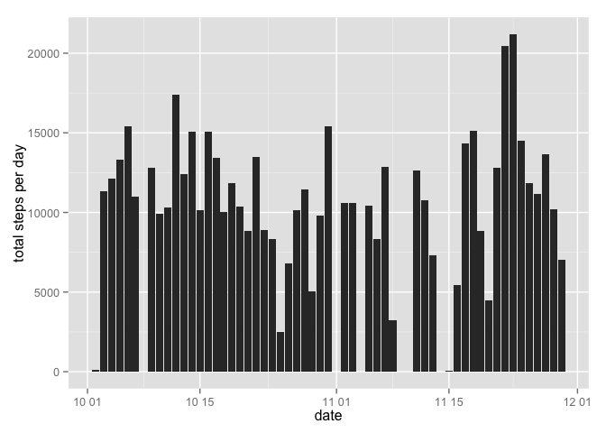
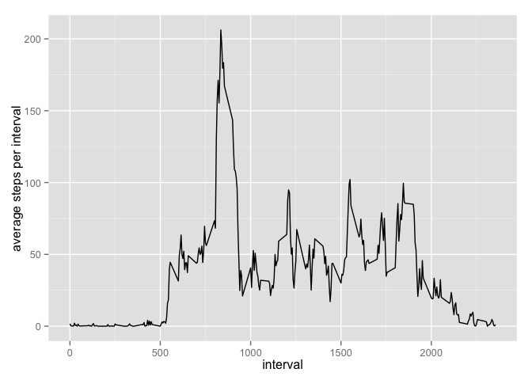
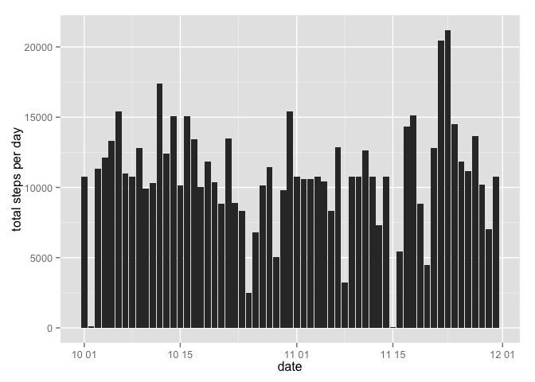
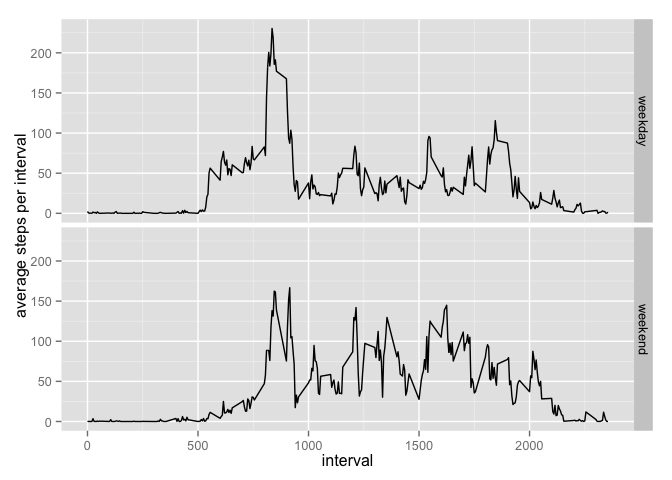

# Reproducible Research: Peer Assessment 1


## Loading and preprocessing the data


```r
library(dplyr)
library(ggplot2)
data <- read.csv(file = "activity.csv")
data$date <- as.POSIXct(strptime(as.character(data$date), format="%Y-%m-%d"))
```

## What is mean total number of steps taken per day?

```r
steps_per_day <- tbl_df(data[which(complete.cases(data)),]) %>%
    group_by(date) %>%
    summarise(total=sum(steps))
g <- ggplot(data = steps_per_day, aes(x = date, y = total))
g + geom_histogram(stat="identity") + ylab("total steps per day")
```

 

mean

```r
mean(steps_per_day$total)
```

```
## [1] 10766.19
```
median

```r
median(steps_per_day$total)
```

```
## [1] 10765
```

## What is the average daily activity pattern?

```r
steps_per_interval <- tbl_df(data[which(complete.cases(data)),]) %>%
    group_by(interval) %>%
    summarise(average=mean(steps))

g <- ggplot(data = steps_per_interval, aes(x = interval, y = average))
g + geom_line() + ylab("average steps per interval")
```

 

interval that contains the maximum number of steps

```r
ind <- which(steps_per_interval$average == max(steps_per_interval$average))
start <- steps_per_interval[ind-1,][1]
end <- steps_per_interval[ind,][1]
paste(as.character(start$interval), as.character(end$interval), sep=" ~ ")
```

```
## [1] "830 ~ 835"
```


## Imputing missing values
total number of rows with NAs

```r
length(data[,1]) - length(which(complete.cases(data)))
```

```
## [1] 2304
```

dataset with missing values filled with mean steps of corresponding 5-minute interval

```r
data_filled_nas <- tbl_df(merge(data, steps_per_interval, by.x = "interval", by.y = "interval")) %>%
    mutate(steps = ifelse(is.na(steps), average, steps))

steps_per_day_filled_nas <- data_filled_nas %>%
    group_by(date) %>%
    summarise(total=sum(steps))

g <- ggplot(data = steps_per_day_filled_nas, aes(x = date, y = total))
g + geom_histogram(stat="identity") + ylab("total steps per day")
```

 

mean

```r
mean(steps_per_day_filled_nas$total)
```

```
## [1] 10766.19
```
median

```r
median(steps_per_day_filled_nas$total)
```

```
## [1] 10766.19
```

## Are there differences in activity patterns between weekdays and weekends?

```r
# locale of my evironment is chinese so I have to use chinese characters to differentiate weekdays and weekends
data_filled_nas <- mutate(data_filled_nas, wd=as.factor(ifelse(
    weekdays(date) == "星期日" | weekdays(date) == "星期六", "weekend", "weekday")))

steps_per_interval_by_weekday <- data_filled_nas %>%
    group_by(wd, interval) %>%
    summarise(average=mean(steps))

g <- ggplot(data = steps_per_interval_by_weekday, aes(x = interval, y = average))
g + geom_line() + ylab("average steps per interval") + facet_grid(wd ~ .)
```

 
